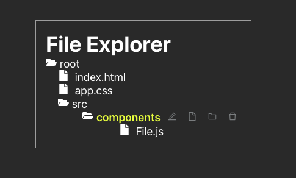

# README
The following API lets you create a new directory, new file and view the entire directory tree structure.

## Run the App
1. Clone the directory
2. Go to directory ```server``` and run ```python3 server.py``` to start the server
3. Go to directory ```explorer-app```
4. Run ```npm start``` to start the app
5. Verify the creation and deletion of files under directory ```server/myfiles```

## Demo





## View Directory
1. Do a GET request ```0.0.0.0:5432/directory```
2. Output :
   ```json
   [
    {
        "name": "ex.txt",
        "type": "file"
    },
    {
        "name": "test",
        "type": "folder"
        "children": [
            {
                "name": "test.txt",
                "type": "file"
            }
        ],
    }]
   ```

## Create a New File
1. Do a POST Request ```0.0.0.0:5432/newfile``` with below json body
```json
{
  "file_name":"test.txt",
  "path":""
}
```

## Create a New Directory
1. Do a POST request ```0.0.0.0:5432/newfile``` with below json body
```json
{
  "dir_name":"test",
  "path":""
}
```

